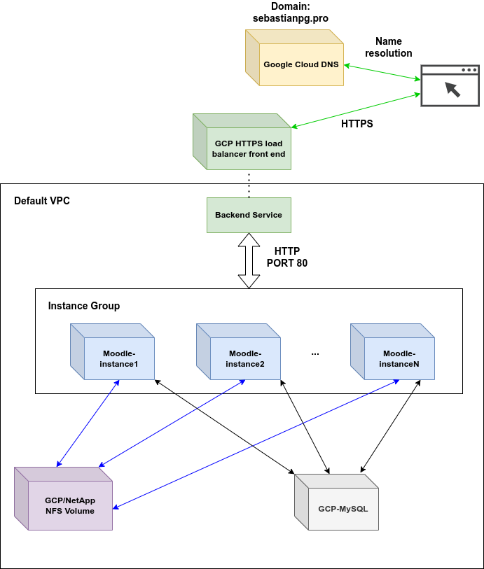

```
- ST0263, Challenge 4

Students:
- Sebastian Pulido Gomez, spulido1@eafit.edu.co
- Daniel Arango Hoyos, darangoh@eafit.edu.co

Professor:
- Edwin Nelson Montoya Munera, emontoya@eafit.edu.co
```


# Moodle on GCP

## 1) Description

## 1.1) Accomplished requirements

The Moodle deployment for this project has the following accomplishments as requested:

- NFS deployment via a [GCP/NetApp](https://cloud.google.com/architecture/partners/netapp-cloud-volumes/creating-nfs-volumes) volume.
- MySQL database deployment via [GCP Cloud SQL](https://cloud.google.com/sql) service.
- Autoscaling of Moodle instances via [GCP instance groups](https://cloud.google.com/compute/docs/instance-groups).
- Load balancing of instance group via a [GCP load balancer](https://cloud.google.com/load-balancing)
- LMS can be reached via sub-domain `reto4.sebastianpg.pro`.
- SSL certificates for wildcard domain `*.sebastianpg.pro`.
- DNS zone management via [Google Cloud DNS](https://cloud.google.com/dns).


## 2) Architecture

The following diagram depicts the system's architecture:



This architecture is intended to provide a service that is highly available, and scalable. On the stateful layer we have
the purple box with an instance of a NFS volume that is provided by GCP/NetAPP and stores Moodle's files. These NFS volumes
are designed to be highly available and their throughput can be adjusted according to the demands of the system. On the other hand,
the database (gray box) was deployed via the Google SQL cloud service which provides a fully managed relational database
service for Moodle's MySQL database.

On the server layer, we have multiple blue boxes with the Moodle service organized in an `Instance Group`. An instance group
is a GCP service that implements autoscaling. In our case, Moodle services will scaled up or down depending on the HTTP
request load.

On the balancing layer, we have the green boxes with a `Backend Service` that balances the HTTP load across the Moodle
instances in the instance group. The backend service, in turn, forwards the responses from the Moodle instances to the load
balancer front-end. This front-end is in charge of serving the responses to the web browser clients that connect via HTTPs.

Finally, the Google Cloud DNS was also used for creating the zone to manage the `*.sebastianpg.pro` domain. For this project
the subdomain `reto4.sebastianpg.pro` was created.
