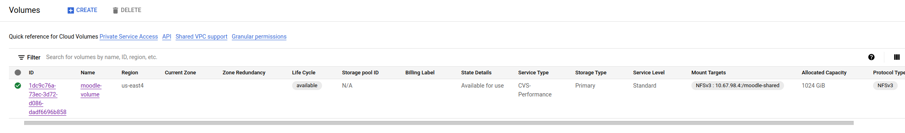
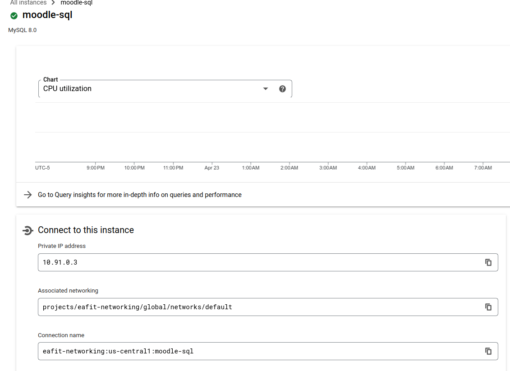
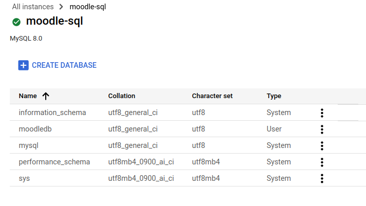
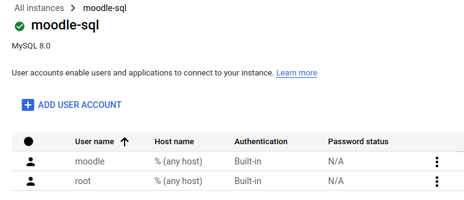

```
- ST0263, Challenge 4

Students:
- Sebastian Pulido Gomez, spulido1@eafit.edu.co
- Daniel Arango Hoyos, darangoh@eafit.edu.co

Professor:
- Edwin Nelson Montoya Munera, emontoya@eafit.edu.co
```


# Moodle on GCP

## 1) Description

## 1.1) Accomplished requirements

The Moodle deployment for this project has the following accomplishments as requested:

- NFS deployment via a [GCP/NetApp](https://cloud.google.com/architecture/partners/netapp-cloud-volumes/creating-nfs-volumes) volume.
- MySQL database deployment via [GCP Cloud SQL](https://cloud.google.com/sql) service.
- Autoscaling of Moodle instances via [GCP instance groups](https://cloud.google.com/compute/docs/instance-groups).
- Load balancing of instance group via a [GCP load balancer](https://cloud.google.com/load-balancing)
- LMS can be reached via sub-domain `reto4.sebastianpg.pro`.
- SSL certificates for wildcard domain `*.sebastianpg.pro`.
- DNS zone management via [Google Cloud DNS](https://cloud.google.com/dns).


## 2) Architecture

The following diagram depicts the system's architecture:


This architecture is intended to provide a service that is highly available, and scalable. On the stateful layer we have
the purple box with an instance of a NFS volume that is provided by GCP/NetAPP and stores Moodle's files. These NFS volumes
are designed to be highly available and their throughput can be adjusted according to the demands of the system. On the other hand,
the database (gray box) was deployed via the Google SQL cloud service which provides a fully managed relational database
service for Moodle's MySQL database.

On the server layer, we have multiple blue boxes with the Moodle service organized in an `Instance Group`. An instance group
is a GCP service that implements autoscaling. In our case, Moodle services will scaled up or down depending on the HTTP
request load.

On the balancing layer, we have the green boxes with a `Backend Service` that balances the HTTP load across the Moodle
instances in the instance group. The backend service, in turn, forwards the responses from the Moodle instances to the load
balancer front-end. This front-end is in charge of serving the responses to the web browser clients that connect via HTTPs.

Notice that there is a VPC for intra-communication among our services.

Finally, the Google Cloud DNS was also used for creating the zone to manage the `*.sebastianpg.pro` domain. For this project
the subdomain `reto4.sebastianpg.pro` was created.


## 3) Development environment


There is not a lot of material for the development environment. However, we did try out the `bitnami/moodle` image via
`docker-compose` and a local dockerized MySQL instance. Once we learned how to configure the docker-compose file for
bitnami/moodle we got rid of the local version and started to set up the production deployment directly on GCP.


### 3.3) Project structure

The following directory structure shows some of the configuration files that we implemented throughout the deployment process:

```
st0263-lms
├── configs
│   └── fstab
├── docker
│   └── moodle
│       ├── bash.sh
│       ├── docker-compose.yaml
│       └── service.sh
├── first-time-install.sh
├── get-cert.sh
└── README.md

```

## 4) Deployment details

### 4.1) NFS server

For the NFS we decided to use a GCP/NetAPP NFS volume:



The volume of an standard CVS-performance type which works on a regional basis. In this case it was deployed the us-east4 region
as not all regions provide this service. The reason why we decided to go with this type of volume is that the regular CVS
worked on a global basis (multi-region) and its configuration turned out to be more complex and we could not make it work properly
in our default VPC.

### 4.2) Mysql Cloud Service

For the database we decided to use the Google SQL cloud service:



This instance is running on the `10.91.0.3` private IP inside our default VPC. It is a `sandbox` type of instance which
is the least performant but allowed us to save several credits. Once the database engine was deployed, we created the
database `moodledb` and the user `moodle`:





### 4.3) Instance group and autoscaling
