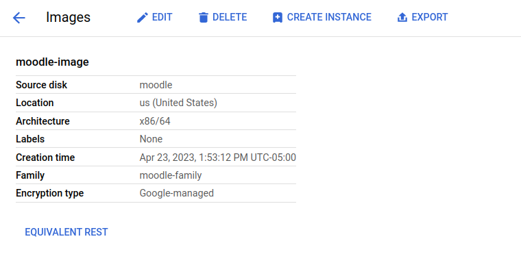
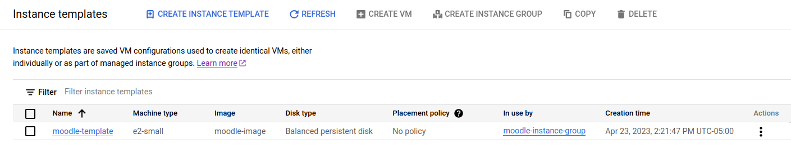
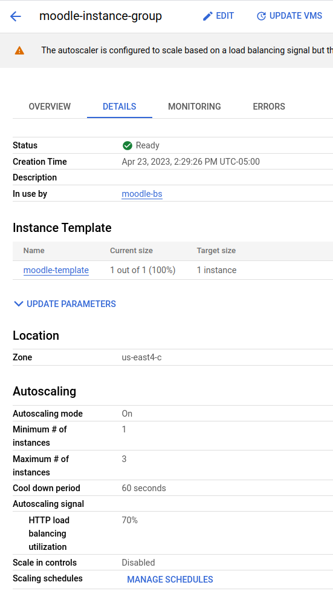
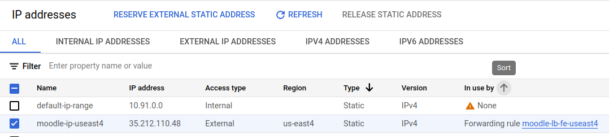
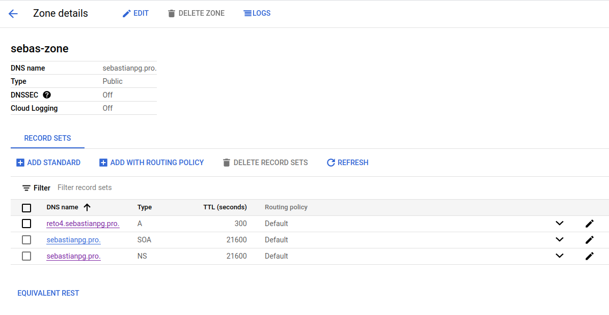
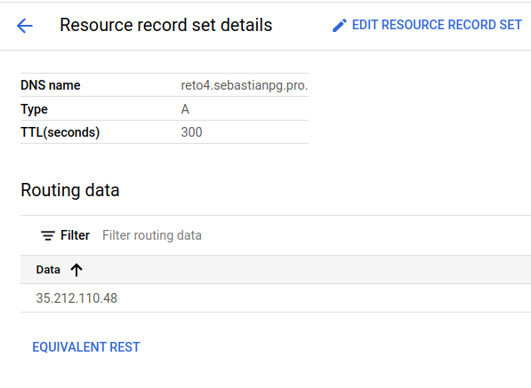

```
- ST0263, Challenge 4

Students:
- Sebastian Pulido Gomez, spulido1@eafit.edu.co
- Daniel Arango Hoyos, darangoh@eafit.edu.co

Professor:
- Edwin Nelson Montoya Munera, emontoya@eafit.edu.co
```


# Moodle on GCP

## 1) Description

## 1.1) Accomplished requirements

The Moodle deployment for this project has the following accomplishments as requested:

- NFS deployment via a [GCP/NetApp](https://cloud.google.com/architecture/partners/netapp-cloud-volumes/creating-nfs-volumes) volume.
- MySQL database deployment via [GCP Cloud SQL](https://cloud.google.com/sql) service.
- Autoscaling of Moodle instances via [GCP instance groups](https://cloud.google.com/compute/docs/instance-groups).
- Load balancing of instance group via a [GCP load balancer](https://cloud.google.com/load-balancing)
- LMS can be reached via sub-domain `reto4.sebastianpg.pro`.
- SSL certificates for wildcard domain `*.sebastianpg.pro`.
- DNS zone management via [Google Cloud DNS](https://cloud.google.com/dns).


## 2) Architecture

The following diagram depicts the system's architecture:


This architecture is intended to provide a service that is highly available, and scalable. On the stateful layer we have
the purple box with an instance of a NFS volume that is provided by GCP/NetAPP and stores Moodle's files. These NFS volumes
are designed to be highly available and their throughput can be adjusted according to the demands of the system. On the other hand,
the database (gray box) was deployed via the Google SQL cloud service which provides a fully managed relational database
service for Moodle's MySQL database.

On the server layer, we have multiple blue boxes with the Moodle service organized in an `Instance Group`. An instance group
is a GCP service that implements autoscaling. In our case, Moodle services will scaled up or down depending on the HTTP
request load.

On the balancing layer, we have the green boxes with a `Backend Service` that balances the HTTP load across the Moodle
instances in the instance group. The backend service, in turn, forwards the responses from the Moodle instances to the load
balancer front-end. This front-end is in charge of serving the responses to the web browser clients that connect via HTTPs.

Notice that there is a VPC for intra-communication among our services.

Finally, the Google Cloud DNS was also used for creating the zone to manage the `*.sebastianpg.pro` domain. For this project
the subdomain `reto4.sebastianpg.pro` was created.


## 3) Development environment


There is not a lot of material for the development environment. However, we did try out the `bitnami/moodle` image via
`docker-compose` and a local dockerized MySQL instance. Once we learned how to configure the docker-compose file for
bitnami/moodle we got rid of the local version and started to set up the production deployment directly on GCP.


### 3.3) Project structure

The following directory structure shows some of the configuration files that we implemented throughout the deployment process:

```
st0263-lms
├── configs
│   └── fstab
├── docker
│   └── moodle
│       ├── bash.sh
│       ├── docker-compose.yaml
│       └── service.sh
├── first-time-install.sh
├── get-cert.sh
└── README.md

```

## 4) Deployment details

### 4.1) NFS server

For the NFS we decided to use a GCP/NetAPP NFS volume:


The volume of an standard CVS-performance type which works on a regional basis. In this case it was deployed the us-east4 region
as not all regions provide this service. The reason why we decided to go with this type of volume is that the regular CVS
worked on a global basis (multi-region) and its configuration turned out to be more complex and we could not make it work properly
in our default VPC.

Notice that this volume is being served on `10.67.98.4/moodle-shared` mounting point with the NFSv3 protocol.

### 4.2) Mysql Cloud Service

For the database we decided to use the Google SQL cloud service:


This instance is running on the `10.91.0.3` private IP inside our default VPC. It is a `sandbox` type of instance which
is the least performant but allowed us to save several credits. Once the database engine was deployed, we created the
database `moodledb` and the user `moodle`:


### 4.3) Virtual machine image and instance template

First we created a regular GCP virtual machine running on a Ubuntu 22.04 image. On that machine we installed docker-compose
and docker and ran a moodle instance with the following docker-compose configuration:

```
version: '3.1'
services:
  moodle:
    container_name: moodle
    image: bitnami/moodle:4.1.2
    ports:
      - "80:8080"
      - "443:8443"
    restart: always
    environment:
      MOODLE_DATABASE_TYPE: mysqli
      MOODLE_DATABASE_HOST: 10.91.0.3
      MOODLE_DATABASE_PORT_NUMBER: 3306
      MOODLE_DATABASE_USER: moodle
      MOODLE_DATABASE_NAME: moodledb
      MOODLE_DATABASE_PASSWORD: secret
      MOODLE_USERNAME: user
      MOODLE_PASSWORD: secret
      MOODLE_SKIP_BOOTSTRAP: yes
    volumes:
      - ${MOODLE_DATA}:/bitnami

```

where `MOODLE_DATABASE_HOST` points to the MySQL instance mentioned in 4.2, and `MOODLE_DATA` is an environment variable
with the value `/mnt/moodle-shared` where the NFS mounting point was established. The `/etc/fstab` file for this instance
was also modified with the following configuration:

```
LABEL=cloudimg-rootfs   /        ext4   discard,errors=remount-ro       0 1
LABEL=UEFI      /boot/efi       vfat    umask=0077      0 1

10.67.98.4:/moodle-shared    /mnt/moodle-shared   nfs auto,nofail,noatime,nolock,intr,tcp,actimeo=1800 0 0
```

This way it would always mount the NFS volume at boot time.

Once the virtual machine was equipped with the mounting point and the Moodle container we created an image out of it:



This image is a replica of the VM's disk and it is possible to create identical instances out of it. Most importantly,
this image was necessary to create our instance template:



Instance templates are useful for allowing GCP instance groups replication of VM instances.

### 4.4) Instance groups

Given the instance image above we created an instance group for replicating the dockerized Moodle services:



This instance group provides auto-scaling and it was set up in such a way that if the HTTP load of an instance was around 80%,
a new virtual machine would be created automatically by GCP. Notice that for this project, we set the maximum number of
instances to 3. This instance group also scales down instances in case that the demand is low.

### 4.5) Static external IP

We reserved the following IP address:



### 4.6) Google Cloud DNS

We used the Google Cloud DNS to create the zone that would host the `*.sebastianpg.pro` domain and its subdomain `reto4.sebastianpg.pro`.
The following DNS records were created:



The `A` record pointed to the external IP mentioned in 4.5:




### 4.7) SSL certificates and Domain

The SSL certificates were created with `certbot` and its  `dns-google` plugin via the following command:

```
sudo certbot certonly -vvv --dns-google --dns-google-propagation-seconds 120 --dns-google-credentials ./eafit-networking-18bcb2ec5865.json -d "*.sebastianpg.pro"
```

The `eafit-networking-18bcb2ec5865.json` file is a credentials file for an account service that would allow certbot to
access the DNS zone we created above and set up the TXT records for the ACME challenge:


Once the certificate was created, we used GCP's certificate manager to upload it and create a regional certificate for
our load balancer:


The domain was already hosted in `name.com` and we only had to set up the google DNS servers in the administrative console:


